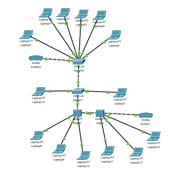

# Informe De Trabajo Práctico 2 -   Componentes, equipamiento, tramas de redes Ethernet y IEEE802.11 VLans  Agustín Samperi 

### Actividad 1
#### conexión de la red y switch

## ICMP 

Debido a que los protocolos ip no son fiables, ya que los datagramas pueden perderse o llegar con defectos al destino que fue mandado, entonces el protocolo ICMP ( Internet Control Message Protocol) se encarga de informar al origen si se ha producido algun error en la entrega del mensaje, pero no solo se enfoca en esto tambien tiene otras funcionalidades, como transportar distintos tipos de mensajes de control : 
 Tipo 0 : Echo reply, es un tipo de mensaje usado para verificar si hay conexion con la ip que nos mando un echo request, ya que su funcion es mandar un echo reply a quien mando ping hacia esta maquina 
 El codigo debe tener code = 0, los datos que estan en el echo request tambien tienen que estar en el echo reply 
 Tipo 3 : Destination Unreachable, este mensaje lo crea el enrutador para "decirle" o comunicarle al host de que al destino que puede llegar es inalcanzable para el host, si se recibe de parte de host destino significa que el protocolo que se intento acceder no esta activo en aquel momento , los codigos varian desde 0 hasta 15 
 Tipo 8 : Echo request, es un mensaje que se envia a un host destino con la expectactiva de que responda con echo reply, esto es conocido tambien como ping, todo echo request es respondido con un echo reply. 

#### Entonces 
Como podemos ver en la imagen de nuestra trama, nos muestra un tipo 0, es decir un echo reply, con su codigo 0, el checksum, la secuencia de numeros y el identificador, como la secuencia de numeros y el identificador sirven para poder ser usado por el cliente para asociar cada echo request a cada echo reply.   
Como nosotros mandamos un ping con la linea de comandos (en packet tracer), es entendible que hayamos encontrado esta trama cuando la analizamos y entendemos los diferentes tipos de mensajes de control de ICMP podemos averiguar que si, se trata de un echo reply, es decir que el host destino respondio efectivamente a la solicitud ping que hicimos con el host origen 
## STP

La funcionalidad del STP es crear topologicas logicas libres de bucles dentro de redes de area local. Su funcion es basica intenta evitar estos bucles que se crean por la existencia de enlaces redundantes. Como el nombre lo indica (Protocolo de arbol de expansion)  es crear un jerarquia logica (o arbol logico) sobre una red de "malla fisica", el protocolo crea puentes de union sobre estos enlaces y a traves de distintos algoritmos se define cual es el puente que tiene mayor prioridad, al que tiene maxima prioridad se le asigna como si fuera "Root Bridge" y va a ser el encargado de mandar jerarquicamente las interfaces por las cuales se speraan los diferentes dominios de colision. 
Todo el control del STP se realizada mediante tramas llamadas BPDU 
### En este caso 
Podemos ver la trama BPDU el cual contiene distintos campos para su configuracion   
  **Protocolo ID** :  Identificador del protocolo es (0x0000 en STP / RSTP)
  **Version** : La verison del protocolo puede ser 0 = stp, 2 = RSTP Y 4 = MSTP 
  **BPDU Type** : 0x00 = Configuracion de BPDU y 0x80 = TCN BPDU 
  **Flags** : Bits que indican, si la topologia cambio, rol del puerto, etc 
  **Root Bridge** : Prioridad ( 2 bytes) + Direccion MAC (6 bytes) del puente raiz 
  **Path Cost** : Costo acumulado hacia el puente raiz 
  **Bridge Id** : Prioridad + MAC del puente actual 
  **Port Id**  : Identificador del puente original 
  **Massage Age** : Tiempos en segundos desde que se genero en la raiz 
  **Max Age** : Tiempo maximo de vida (default : 20s)  
  **Hello Time** : Intervalo entre BPDUs (default : 2s)
  **Forward Delay** : Tiempo en estados transitorios 

### Colisiones usando el comando ping 
### Vlan1 
Mande un ping -n 1 200.0.0.255 desde la computadora 13 que pertence a la lan virtual 1 hacia todas las computadoras que pertenecen en la misma lan, como podemos observar se nota que respondieron correctamente

### Procesamiento de paquetes en computadoras 
En la siguiente imagen notamos que las computadoras procesan el paquete para enviar un echo reply hacia la computadora que envio ping 

#### Procesamiento de paquetes en switch 
 

Llegan todos los paquetes juntos al switch pero en distintos tiempo ya que no se ocasiona una colision 

Estos son enviados al siguiente switch de forma secuencial hasta que hayan llegado todos los paquetes de "echo reply" hacia quien hico el echo request o sea nuestra maquina 13, el cual llega correctamente.

### Vlan2 
Mande un ping -n 1 200.0.0.255 desde la computadora 14 hacia todos los distintos destinos de la red vlan2 
 
El switch1 manda los paquetes hacia hub0 y switch0 ya que la laptop 6 pertence a nuestra vlan2 

llegan los paquetes a destino 

los paquetes son procesados por los host de destino y estos reenvianel echo request hacia el hub para que llegue a nuestra laptop 14 que fue quien hizo el echo reply, pero al llegar al hub entra en problemas, ya que se realiza una colision

Aca es donde entra el algoritmo CSMA/CD para evitar estas colisiones las placas de red al ver que el voltaje del ethernet esta siendo alterado porque esta viajando otro paquete atraves del mismo, espera hasta que detecta silencio en el medio por el que se transporta, y manda los paquetes, esto se hacen para evitar las colisiones, el algoritmo CSMA unas de sus funciones es hacer que cada host espere un tiempo aleatorio hasta mandar sus paquetes, si dos host mandaron el mismo paquete a la vez, se produce la colision y estos hosts que colisionaron emiten una secuencia de bits llamadas jam signal que es mandado al medio para evitar que se choquen mas paquetes, haciendo que todos dejen de enviar estos paquetes y ahi es donde se produce la espera del tiempo aleatorio 
