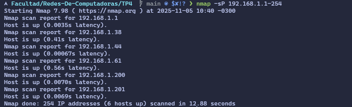

# TRABAJO PRÁCTICO N°4 - CAPA DE TRANSPORTE - SOCKETS TCP Y UDP - PUERTOS
#### Agustín Samperi
## Actividad 4
### ESCANEO DE PUERTOS 4.1 :  
Escaneo ICMP : nmap -sP 192.168.1.1-254 

Podemos ver que encontramos todas las ip que estan en el rango de 192.168.1.1 hasta 192.168.1.254 
y obtenemos 6 host que estan conectados 
* Escaneo SYN al puerto 80 : sudo nmap -sS -p 80 192.168.1.1-254
tarting Nmap 7.98 ( https://nmap.org ) at 2025-11-05 10:43 -0300
`Nmap scan report for 192.168.1.33
Host is up (0.54s latency).

PORT   STATE  SERVICE
80/tcp closed http
MAC Address: BA:AD:92:F5:98:53 (Unknown)

Nmap scan report for 192.168.1.34
Host is up (0.45s latency).

PORT   STATE  SERVICE
80/tcp closed http
MAC Address: 5E:54:60:C5:A2:5A (Unknown)

Nmap scan report for 192.168.1.35
Host is up (0.31s latency).

PORT   STATE  SERVICE
80/tcp closed http
MAC Address: 0A:16:36:F5:07:F5 (Unknown)

Nmap scan report for 192.168.1.36
Host is up (0.33s latency).

PORT   STATE  SERVICE
80/tcp closed http
MAC Address: 86:61:AC:45:F6:25 (Unknown)

Nmap scan report for 192.168.1.38
Host is up (0.32s latency).

PORT   STATE  SERVICE
80/tcp closed http
MAC Address: 2C:96:82:BB:FF:F9 (MitraStar Technology)

Nmap scan report for 192.168.1.61
Host is up (0.97s latency).

PORT   STATE SERVICE
80/tcp open  http
MAC Address: 2C:96:82:BB:FF:F9 (MitraStar Technology)

Nmap scan report for 192.168.1.200
Host is up (0.56s latency).

PORT   STATE  SERVICE
80/tcp closed http
MAC Address: D4:AB:82:63:16:F2 (Commscope)

Nmap scan report for 192.168.1.201
Host is up (0.41s latency).

PORT   STATE  SERVICE
80/tcp closed http
MAC Address: 2C:96:82:BB:FF:F9 (MitraStar Technology)

Nmap scan report for 192.168.1.44
Host is up.

PORT   STATE    SERVICE
80/tcp filtered http

Nmap done: 254 IP addresses (9 hosts up) scanned in 16.69 seconds`

En la salida del comando de escaneo SYN podemos notar que solo hay un puerto abierto, que repondio 
a nuestra petición SYN, este pertenece a la MAC 2C:96:82:BB:FF:F9, el cual pertenece al router ya que es MistraStar Technology , a demás lo que nos devuelve el comando, es también los host que pertenecen a mi red 
## Escanear puertos abiertos a un compañero 4.2 
Cuando use el comando : `sudo nmap -sS -p 21-3389 IP_DE_MI_COMPAÑERO `
el mismo me respondio con un puerto que esta abiertos 
`Nmap scan report for 192.168.1.40
Host is up (0.0061s latency).
Not shown: 3368 filtered tcp ports (no-response)
PORT   STATE SERVICE
22/tcp open  ssh
MAC Address: 70:85:C2:01:41:C5 (ASRock Incorporation)

Nmap done: 1 IP address (1 host up) scanned in 11.35 seconds`

Como es el puerto 22 este pertenece a ssh el cual es cifrado y seguro, pero por ejemplo tienen diferentes formas de poder romper sus vulnerabilidades, estas son  : 
* Ataque de fuerza bruta : El atacante intenta adivinar las contraseñas de las cuentas lo mejor para evitar esto es deshabilitar la autenticación por contraseña y usar claves privadas/publicas
* Enumeración de Usuarios : Las configuraciones antiguas de ssh permitian que el atacante obtuvieran el nombre de los usuarios que son válidos para el sistema, lo mejor para evitar esto es actualizar constantemente OpenSSH
* Configuraciones Debiles : Esto es si se permite directamente que entre como root del sistema o que se utilicen contraseñas debiles
En caso de tener el puerto 21 con FTP es mejor empezar a usar SFTP ( usa el puerto 22 como ssh ya que esta mejor cifrado)

